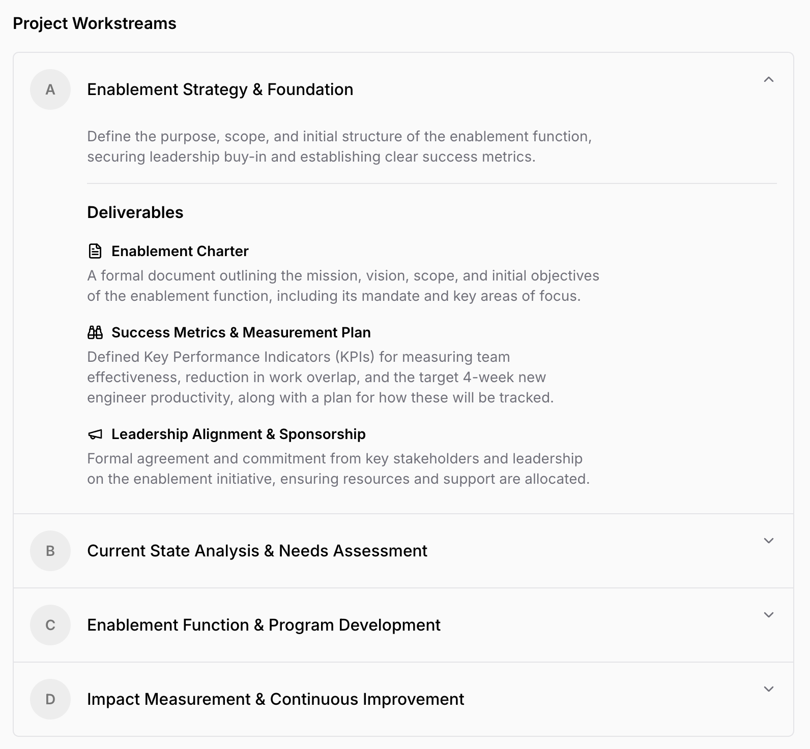

# Tekkr Full Stack Hiring Challenge

_👋 Welcome to this full stack hiring challenge! ✨_

Please don't spend much more than 3-4 hours solving this challenge -> if you find yourself spending more time, please stop and submit what you have.

## Instructions

The `web` directory contains all code for the frontend React application.
The `server` directory contains all code for the backend application based on [Fastify](https://fastify.dev/).

To get started:
1. Clone this repository
2. Run `npm install` in both directories to install dependencies. 
3. Then, run `npm start` in both directories to start the backend and the frontend (they will auto-refresh as you change the code). The frontend runs on port 3000, backend on port 8000.

> You can add as many files and endpoints as you want, try to avoid changing existing code unless necessary.
> You can also add dependencies as needed.

### Submission
Once you are done, please push your code to a public GitHub repository and send us the link.

## Your Job

#### Features to Implement
Take the existing app and add the following features:
1. Implement the existing chat window and turn it into an LLM-based chat. Typed messages should be sent to the backend and handled by an LLM of your choice (out of Gemini, OpenAI, and Anthropic).
   - The user must be able to start a new chat by using the "New Chat" button.
   - New chats should show up in the sidebar (the names of the chats don't matter) and the user must be able to switch between chats.
   - When sending a message, there should be a loading indicator, then the response from the LLM should be displayed in the chat window.
   - When reloading the page, all chats should still be available.
2. Implement an inline-preview for project plans.
    - When the user requests a "project plan" from the LLM, there should be an inline preview of the plan in the chat window.
    - The preview should look like the one in the following image (the icons can be ignored, but sections should be expandable/collapsible).
    - It must be possible for the plan to appear in the middle of a message (not just at the end or beginning).

> 👉 The project plan consists of a variable number of "workstreams" (each with a title and description) that then contain a variable number of "deliverables" (also each with a title and description).

#### Additional Requirements
- When reloading the page, the chat history must be preserved and the same chat must be selected as before the reload.
- Errors should be handled gracefully
- Use `shadcn/ui` frontend components, some of them have already been added (https://ui.shadcn.com/docs).
- Use React Query for interactions with the backend (https://tanstack.com/query/latest).
- It should be very easy for another developer to replace the LLM you used with another one (e.g. from OpenAI to Anthropic).

#### Out of scope
- You do not need to run a database to store data in the backend, in-memory storage is fine.
- Responsiveness or any other optimization for mobile devices is not required.
- It is fine to assume there is only one user (no need for authentication or any sort of user context handling)
- No need to write tests

### Bonus Task
- Add a visual AI Model selector in the chat homepage to allow switching between different models (eg. Gemini 2.5 Flash, GPT-5 mini) for the chat.

### Deliverables
The Deliverable: A Loom video (screen only is fine) showing:
- A 2-5 minute explanation of how you built your solution.
- A link to your repository.
> [!Note] 
> It's not required to show your face. Share your screen, walk us through your code logic, and show us the app working. We care about your clarity of thought, not your presentation skills.
